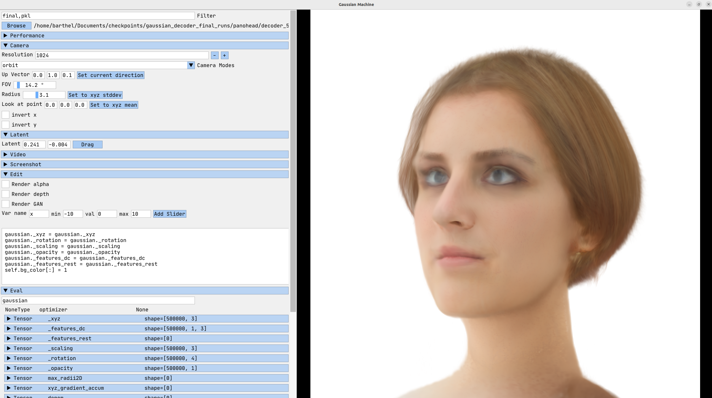

# Gaussian GAN Decoder


Official implementation for: https://arxiv.org/abs/2404.10625

Project page: https://florian-barthel.github.io/gaussian_decoder/index.html


In this work, we present a novel approach that combines the high rendering quality of NeRF-based 3D-aware GANs with the 
flexibility and computational advantages of 3DGS. By training a decoder that maps implicit NeRF representations to 
explicit 3D Gaussian Splatting attributes, we can integrate the representational diversity and quality of 3D GANs into 
the ecosystem of 3D Gaussian Splatting for the first time. Additionally, our approach allows for a high resolution GAN 
inversion and real-time GAN editing with 3D Gaussian Splatting scenes.

## Installation

```bash
# clone
git clone https://github.com/fraunhoferhhi/gaussian_gan_decoder.git --recursive
cd gaussian_gan_decoder

# conda environment
conda env create -f environment.yml
conda activate gs-decoder
```
Download the face ID weights from [here ](https://drive.google.com/drive/folders/10nDj1GknLHFD6aBj7mxfS08QW5Azbg3T?usp=sharing)
and place the whole folder under: _main/pretrained_models_
## Download Pre-trained GAN Models


| Model    | Link                                                                                  | Target Path            |
|----------|---------------------------------------------------------------------------------------|------------------------|
| PanoHead | https://drive.google.com/drive/folders/1m517-F1NCTGA159dePs5R5qj02svtX1_?usp=sharing  | PanoHead/models/       |
| EG3D     | https://catalog.ngc.nvidia.com/orgs/nvidia/teams/research/models/eg3d/files           | eg3d/checkpoints/      |
| LPFF     | https://github.com/oneThousand1000/LPFF-dataset/tree/master/networks                  | eg3d/checkpoints_lpff/ |

## Start Training

```bash
cd main
python train_pano2gaussian_decoder.py
```

You can find all training parameters as click.commands in train_pano2gaussian_decoder.py By default PanoHead is decoded.

## Visualize Results
Download Pre-trained Gaussian GAN Decoder Models from [here](https://drive.google.com/drive/folders/1VPKdnHokjARTGpqrg98X6SXD3YZRMWjo?usp=drive_link).

Our results can be rendered with our custom build 
[gaussian_viewer](https://github.com/Florian-Barthel/gaussian_viewer).
To do so, simply change the renderer from **GaussianRenderer** to **GaussianDecoderRenderer** in run_main.py and select 
the .pkl file of the decoder model.

In order to load the GAN, you will also have to append the sys paths of this repository to the run_main.py like this:

```python
sys.path.append("/home/barthel/projects/CVGGaussianGANDecoder")
#sys.path.append("/home/barthel/projects/CVGGaussianGANDecoder/eg3d") # switch between EG3D and PanoHead
sys.path.append("/home/barthel/projects/CVGGaussianGANDecoder/PanoHead")
sys.path.append("/home/barthel/projects/CVGGaussianGANDecoder/main")
```

If the head is rendered upside down, change the Up-Vector in the Camera tab to (0, 1, 0). Use the latent widget to 
switch between IDs. Using the gaussian_viewer, you can also export .ply files of the current scene (Save / Save Ply)



## Cite
```text
@misc{barthel2024gaussian,
    title={Gaussian Splatting Decoder for 3D-aware Generative Adversarial Networks}, 
    author={Florian Barthel and Arian Beckmann and Wieland Morgenstern and Anna Hilsmann and Peter Eisert},
    year={2024},
    eprint={2404.10625},
    archivePrefix={arXiv},
    primaryClass={cs.CV}
}
```